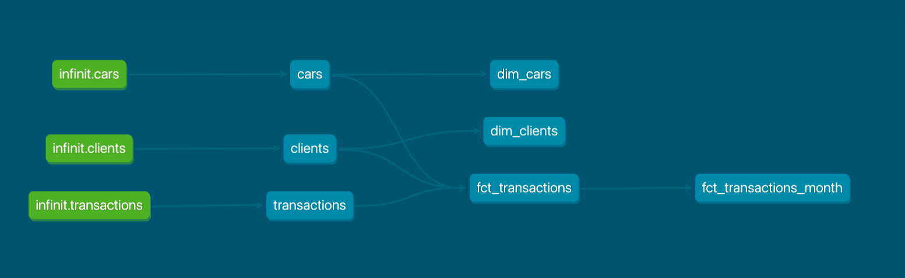
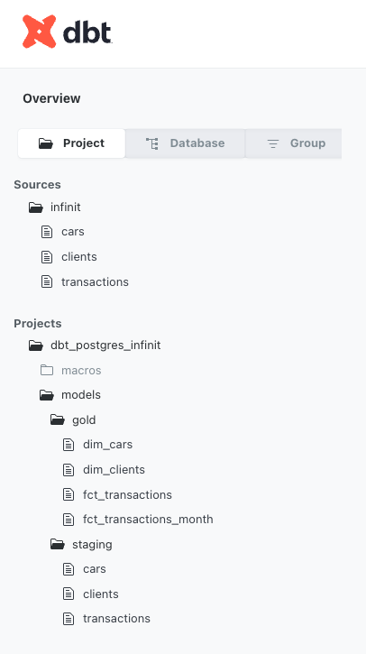
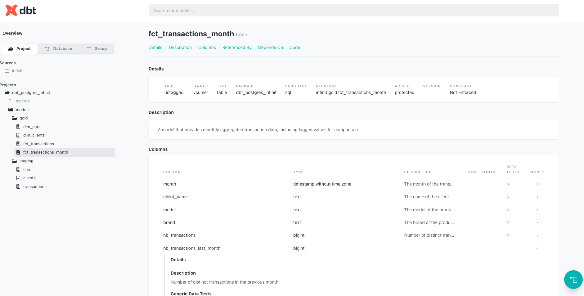
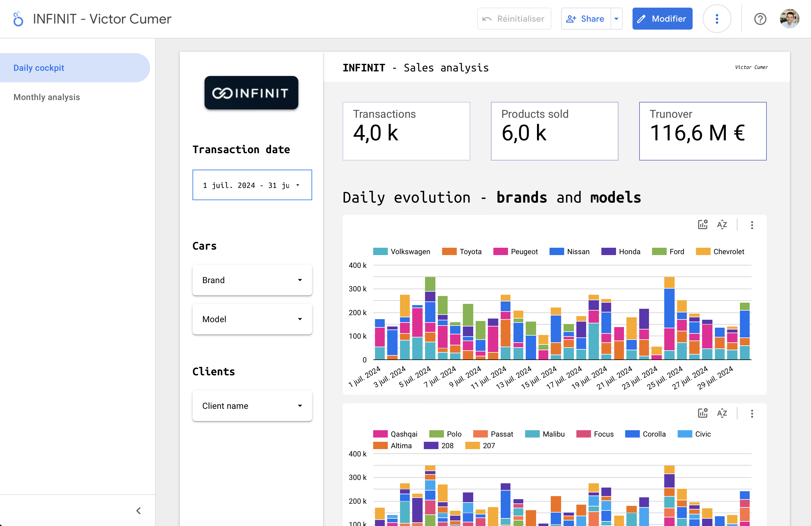

# INFINIT - Data Engineering Business Case

`victor cumer`

## Run the project

```bash
> cd infinit-vcumer/
> docker compose up --build
```

## Available modules

Everything is accessible throught localhost:
 
- port `5432`: data warehouse (postgres)
- port `5433`: operational database that contains the table **Cars** (postgres)
- port `8080`: ETL project documentation (dbt documentation)

Databases have persistent volumes that are in the under the **data/** folder.

## Chosen approach

Requirements: 

1. Load and clean data from each source.
2. Integrate data into a centralized database (data warehouse).
3. Optimize queries for rapid analysis
4. Generate monthly sales reports

**My project architecture:** <br>
For the exercise, we'll stick to: 
- python scripts to ingest data
- local postgres instances
- a simple dbt project to orchestrate the sql transformation queries and tests, no scheduling 
- looker studio for data viz [Infinit - Victor Cumer](https://lookerstudio.google.com/reporting/f8041a27-4b6e-46b3-b2e8-9446f1498ea1)

**A better architecture**: <br>
A more production worthy design would be:
- to handle the data ingestion (sync from diverse sources to a common data warehouse destination) with a lightweight ELT open source tool like [Airbyte](https://airbyte.com).
- to use a full-featured cloud data warehouse like _bigquery_ or _snowflake_.
- to use dbt to version and easily manage all SQL transformations.
- to use an orchestrator like aiflow to trigger scheduled transformations.   
- to use a BI solution like looker or tableau that offer access management / data governance features, semantic layers, enterprise ready charts, caching, etc.

## When you open the project - where to look? What to check?

### 1. Ingestion

Start by having a look at **ingestion_jobs/** folder. What does this simple python app does ? 

- Based on expected sync schemas (fields, type, primary key)
- It extracts the data from the source system with a generic _Source_ class to a pandas dataframe
- It runs several validations and transformations steps on it
- And then loads it to the data warehouse: a local postgres instance

> Running several time the ingestion jobs will ingest the same data in the raw dataset of the data warehouse, but the transformation queries are handling the deduplication.   

At the root of the project, try to run:
```bash
> docker compose up --build -d ingestion_job 
> docker compose logs ingestion_job 
```

### 2. SQL transformation in the data warehouse

The strategy here is to deduplicate the raw data based on the added metadatata (keeping always the most up-to-date version of each message). 
And to model a star schema like gold layer to be used by the analysts or the BI tools. The tables in **gold** dataset are the direct sources of the looker studio dashboard.

To help on the analytics part, I made a table named **fct_transactions_month** dedicated to monthly aggregations and including a month per month comparison (i.e. metric vs value from last month). 

The data warehouse schemas, lineage and transformations are available in the dbt doc: http://localhost:8080 if the project is running.

> If you don't run the docker compose, just open `infinit-vcumer/dbt_postgres_infint/target/index.html` in your browser. 

Below some screenshots of the dbt docs.

Lineage:



Data warehouse structure:



One model doc overview:




### 3. Appealing dashboard answering business needs ? 

You'll find [here](https://lookerstudio.google.com/reporting/f8041a27-4b6e-46b3-b2e8-9446f1498ea1) the link to a Looker Studio board sourceing the gold layer and proposing some data viz to explore the **daily and monthly performances**.

Here is an overview: 

